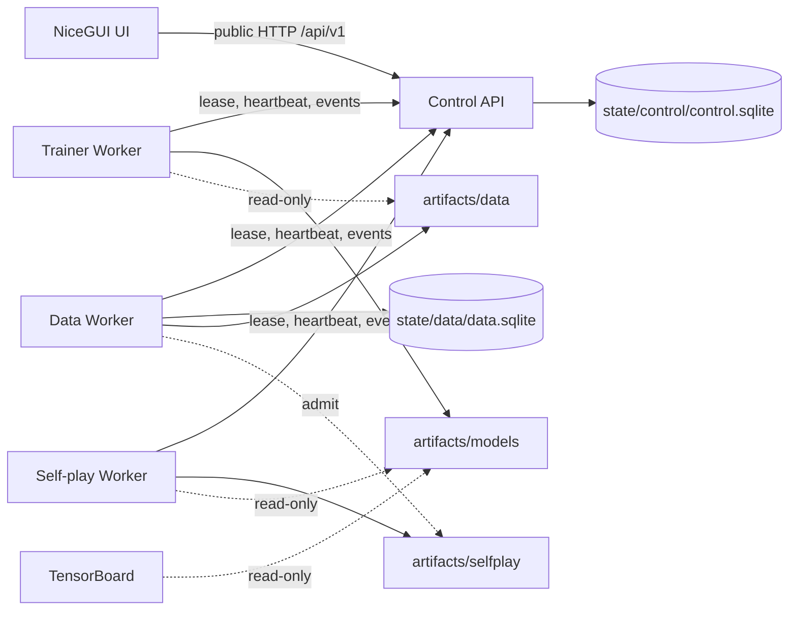

# 系统架构

Zero-TTT 是单仓、多包、五服务的单机系统。服务可以共享本地主机上的不可变对象存储，
但不共享数据库，也不通过 HTTP 传输训练 batch 或 MCTS 热路径张量。

所有权规则：

- Control API 只管理 Run、Workflow、Job、租约、资源互斥和事件，不读取业务数据库或业务产物内容。
- Data Service 是数据 SQLite 与 `artifacts/data` 的唯一写者；原始 `raw` 始终只读。
- Trainer 是 `artifacts/models` 的唯一写者，只读冻结的 dataset manifest 和 shard。
- Self-play 是 `artifacts/selfplay` 的唯一写者，批量推理与 OpenSpiel MCTS 都在进程内。
- UI 无业务卷、无业务状态，只保存当前页面的事件游标。

`packages/contracts` 不依赖 Torch 或任何服务；`packages/game`、`packages/model` 与
`packages/dataset` 提供明确的算法和只读格式边界。`services/*` 之间禁止 Python 导入。

Control 内部由三部分协作：`ControlSession` 管理连接、共享连接锁和原子写事务；
`workflow_steps` 与 `workflow_state` 只描述有限流程及状态规则；`ControlStore` 协调作业、
租约、产物引用和查询。工作流提交的幂等查询与创建共用事务，取消、重试与工作流状态更新
也必须整体提交或回滚。新增流程应先扩展契约枚举和纯规则，再实现对应 Worker 处理器。

`packages/worker-runtime` 负责 HTTP 领取、心跳、结果上报和进程排空退出；业务处理器只接收
`JobEnvelope` 与 `JobContext` 并返回 `JobResult`。生产 Worker 注册版本来自安装包元数据。
