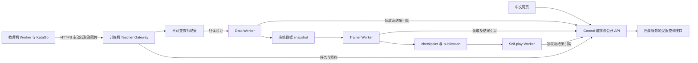

# Zero-TTT 分阶段开发规划：从可视化训练到局域网教师闭环

> 文档性质：分阶段开发规划与验收记录；仅已验收阶段具有对应运行证据，其余内容仍待实施。
> 初始核对日期：2026-09-19；初始源码基线：`d6c5b3cf171487f6f963cebbdc364cec8a33cb4e`。
> 2026-09-19 的首次交付只新增规划和文档入口；后续实施状态见路线总表与阶段交接记录。
> Docker 引擎已实际连通；S01 GPU 短测试已验收，真实教师、双机及正式实验仍需分别验收。

## 1. 如何使用这份规划

这份文档将一个长期目标拆成可以单独开发、验证和交接的阶段。每次实施一个指定阶段，
先检查当前代码是否已经覆盖其中部分要求，再补齐缺口；完成后项目仍应可以运行。
“已有代码”“一次小规模验证通过”“正式运行达标”分别记录，不能相互替代。

- [目标与范围](#scope)
- [当前基线与代码入口](#baseline)
- [架构、身份和数据约束](#architecture)
- [路线总表与依赖](#stages)
- [S01–S08：可信训练、棋谱和人机对弈](#s01)
- [S09–S15：评测、教师适配和主动选点](#s09)
- [S16–S22：持久任务、双机接入和教师辅导](#s16)
- [S23–S28：课程、多轮计划与交付](#s23)
- [固定默认值与评测规则](#defaults)
- [预算、验证和交接](#delivery)
- [本次文档交付记录与后续执行指令](#handoff)

<a id="scope"></a>

## 2. 最终目标与本轮范围

最终用户应能完成以下操作：

1. 打开中文网页，查看环境和数据状态，导入原始棋谱，创建有限训练任务。
2. 看清训练输入、累计进度、曲线、失败原因以及产出的 checkpoint 和 publication。
3. 浏览真实棋谱，逐手回放、导出 SGF，与指定 publication 下棋并查看候选着。
4. 在另一台 Windows＋NVIDIA 机器启动教师 Worker，主动从训练机领取 KataGo 任务。
5. 执行“学生自博弈 → 主动选点 → 教师标注 → 数据准入 → 混合训练 → 固定评测”。
6. 依据正式评测选择教师课程，按有限轮数、训练量和教师查询预算持续推进。
7. 中断后恢复；选择“完成当前任务后停止”时停止接新任务，完成已领取及在途任务后退出。
8. 查询磁盘占用，保护原始数据和在用产物，在隔离位置恢复备份。

本路线保留当前学生模型和严格 FP32，不同时引入 TTT 快权重、625M 扩容、多机分布式
学生训练、公网多人服务、段位认证或新的棋规体系。已有未来模型配置不代表本路线需要启用它们。

网页体验分五次交付：S04 可方便提交训练；S06 可看真实棋谱；S08 可下棋；
S22 可执行教师辅导单轮；S25 可在网页管理有限多轮计划。

<a id="baseline"></a>

## 3. 当前基线：复用什么、还缺什么

### 3.1 本次实际核对

| 项目 | 2026-09-19 核对结果 | 能说明什么 |
| --- | --- | --- |
| Git 基线 | `d6c5b3c`，编写前工作树干净 | 下述代码观察针对该提交 |
| 架构切换点 | `0292b2a` 是微服务重构提交 | 旧设计应从其父提交读取 |
| 历史设计基线 | `0292b2a^`，即 `d887d83` | 仅继承研究目标和可适用约束 |
| Docker Engine | 实际返回 `29.7.2` | 引擎已可访问，不再标记为不可用 |
| Docker Compose | 实际返回 `v5.4.0` | 命令可用，具体配置仍须检查 |
| 开发／测试镜像 | `zero-ttt/dev:1.0.0` 已存在，镜像 ID 前缀 `6228d93bebd4` | 可用于本次文档检查；不代表镜像与全部依赖已重新构建 |
| KataGo 源码 | 子模块 `6a1fc5de9fc253723ac475a0683bf0b9d9b7bd19`，与 `v1.17.2` 标签一致 | 教师适配应针对这一版本 |
| 教师权重 | `models/katago` 当前只有 README 和 manifest 示例 | 尚不能证明真实教师启动成功；未扫描其他磁盘目录 |
| GPU 与双机 | 本次未运行 GPU 训练、KataGo 推理或双机任务 | 留待对应阶段验收，不据此填写容量或吞吐 |

普通沙箱访问 Docker 时曾遇到权限限制；获得所需工具权限后引擎正常返回版本。
应区分“工具无权限”“Docker 未启动”“镜像构建失败”和“业务测试失败”。

### 3.2 已有能力与明确缺口

| 领域 | 已有基础 | 本路线需要补齐 |
| --- | --- | --- |
| 编排 | 三条有限流程、Job、租约、事件、幂等提交与资源互斥 | 同参数新一轮的显式身份、同 Run 顺序、输入冻结、多轮计划 |
| 数据 | trajectory／annotation 格式、SQLite 索引、不可变 snapshot、只读 batch source | 教师结果准入、正式导出标注引用、教师筛选、容量和恢复工具 |
| 训练 | 有限训练、完整 checkpoint、EMA publication、恢复与数据切换方法 | 周期恢复点、作业归属、剩余预算、三路混合、固定验证 |
| 自博弈 | 本地 19×19 棋规、OpenSpiel MCTS、批量推理、整局持久化 | 棋谱查询、互动会话、有限应手、版本对战、原始策略熵 |
| 网页 | 中文部分文案、Run／流程按钮、作业表、事件和 TensorBoard 入口 | 引导式操作、棋盘、曲线、模型关系、教师和课程管理 |
| 教师 | KataGo Dockerfile、Analysis 配置、权重目录约定 | 可运行 Worker、Analysis 适配器、任务匹配、网关和双机部署 |
| 运维 | 隔离 `test` 服务、质量门禁、E2E 脚本、Worker 排空退出 | 可重复验收记录、计划级排空、容量策略和一致性备份 |

以下缺口已经从源码确认，实施时应再次核对：

- Control 的 `submit_workflow` 支持显式幂等键，但省略时按内容生成；
  `_job_inputs` 仍从同 Run 的产物中按时间选择 checkpoint／publication。
  S02 要补齐提交意图、串行依赖与冻结时点，不能只增加一个随机 ID。
- Trainer 已有 `restore` 和 `restore_for_data_transition`，但 `TrainingJobHandler.execute`
  以 Run 目录的最新 checkpoint 参与恢复判断，局部 `steps` 从零开始；
  当前逻辑不能直接作为“任意周期恢复点继续剩余预算”的完成证据。
- Data 底层已有标注和 snapshot 关联表；但服务的 `snapshot` 处理器导出时显式使用
  `annotations = ()`。S20 是接通并加强现有链路，不是从零重写存储。
- 单来源采样身份已包含教师指纹和 annotation mode；混合来源身份目前只汇总
  snapshot 哈希与权重。S21 需要把每个分量的实际采样身份纳入总身份。
- 当前 UI 已能提交三条有限流程；S04 交付的是完整的引导和错误反馈。
- 当前 Worker 已能收到停止信号后排空；S24 增加的是跨轮编排的持久暂停与预算语义。

### 3.3 建议阅读入口

| 内容 | 当前代码或文档 |
| --- | --- |
| 服务边界 | [系统架构](../architecture/overview.md)、[公共契约](../architecture/contracts.md) |
| 流程和事务 | [workflows.py](../../services/control/src/zero_ttt_control/workflows.py)、[store.py](../../services/control/src/zero_ttt_control/store.py) |
| 公共模型 | [contracts/models.py](../../packages/contracts/src/zero_ttt_contracts/models.py) |
| 训练作业与恢复 | [jobs.py](../../services/trainer/src/zero_ttt_trainer/jobs.py)、[learner.py](../../services/trainer/src/zero_ttt_trainer/learner.py) |
| snapshot 导出 | [handlers.py](../../services/data/src/zero_ttt_data/handlers.py)、[snapshots.py](../../services/data/src/zero_ttt_data/snapshots.py) |
| 只读采样 | [source.py](../../packages/dataset/src/zero_ttt_dataset/source.py) |
| 棋规与自博弈 | [rules.py](../../packages/game/src/zero_ttt/game/rules.py)、[collector.py](../../services/selfplay/src/zero_ttt_selfplay_worker/collector.py) |
| 当前界面 | [page.py](../../services/ui/src/zero_ttt_ui/page.py) |
| 教师构建和配置 | [Dockerfile](../../docker/katago/Dockerfile)、[analysis.cfg](../../configs/katago/analysis.cfg) |
| 测试与运维 | [Docker 运维](../operations/docker.md)、[check_docs.py](../../scripts/check_docs.py) |

历史资料使用 Git 读取，避免恢复已删除的旧模块或复制旧运行命令：

```powershell
git show '0292b2a^:docs/workflows/training-lifecycle.md'
git show '0292b2a^:docs/workflows/curriculum-teachers.md'
git show '0292b2a^:docs/workflows/online-distillation.md'
git show '0292b2a^:docs/integrations/lan-teacher.md'
git show '0292b2a^:docs/roadmap/README.md'
```

<a id="architecture"></a>

## 4. 技术选择和必须保持的边界

### 4.1 技术选择

| 部分 | 方案 | 使用边界 |
| --- | --- | --- |
| 部署 | Docker Compose，优先 Windows Docker Desktop／WSL2 | 训练机和教师机分别部署；实际 GPU 兼容性现场验证 |
| 后端 | Python、FastAPI、Pydantic、现有 Worker Runtime | 扩展现有契约和租约，不另建竞争的任务系统 |
| 持久化 | 各服务独立 SQLite＋不可变产物＋`ArtifactRef` | 单写者、内容校验、明确版本；跨服务不用数据库连接 |
| 界面 | NiceGUI＋SVG 棋盘＋ECharts＋TensorBoard | UI 展示状态并发起命令；棋规和任务事实由服务端决定 |
| 学生 | 当前模型、严格 FP32、19×19 棋规、OpenSpiel MCTS、EMA | 小模型只缩模型和工作量，棋盘仍为 19×19 |
| 教师 | 固定 KataGo v1.17.2，Analysis 常驻进程 | 搜索标签、raw policy、Human-SL 输出必须区分 |
| 验证 | Docker 内检查，按阶段增加浏览器、GPU、双机验收 | 本次文档交付只运行文档及相关静态检查 |

NiceGUI 官方示例提供 SVG 图层、鼠标事件和 ECharts 用法，可作为界面实现入口；
实际实施仍需核对仓库锁定版本。参见 [交互图像示例](https://github.com/zauberzeug/nicegui/blob/main/website/documentation/content/interactive_image_documentation.py)
和 [ECharts 示例](https://github.com/zauberzeug/nicegui/blob/main/website/documentation/content/echart_documentation.py)。
KataGo 协议以[仓库固定提交的 Analysis 文档](https://github.com/lightvector/KataGo/blob/6a1fc5de9fc253723ac475a0683bf0b9d9b7bd19/docs/Analysis_Engine.md)为准。

### 4.2 目标服务职责

下图包含待开发的教师与查询能力，不表示现有部署已具备它们。



- **Control** 持有 Run、流程、作业、租约、预算、评测批次和课程决策；
  只保存业务引用和小型结果摘要，不加载模型，不判棋规，不打开其他服务数据库或业务文件。
- **Data** 是数据 SQLite 和 `artifacts/data` 的唯一写者；负责验证、准入、snapshot、
  标注关联和数据查询。原始 `raw` 继续只读。
- **Trainer** 是模型产物的唯一写者；消费冻结来源，输出训练／验证结果和恢复点。
- **Self-play** 负责规则校验、对弈会话正文、棋谱、局面分析和对战执行。
  持久会话若需新库，由该服务独占；Control 只保存编排摘要与引用。
- **Teacher Gateway（新增）** 复用 Control 的持久任务与租约，限制远程访问范围；
  负责受控输入下载、上传暂存、校验后提交教师结果。建议独占 `artifacts/teacher`，
  不直接写 Data 的 annotation 或共享 Control SQLite。
- **教师 Worker（新增）** 持有本机权重、引擎和下载缓存，计算后上传结果；
  缓存可重建，训练机保留权威任务与结果，不要求共享磁盘。
- **UI** 继续只调用 Control 的公开入口；需要棋谱或曲线时，由 Control 转发至所属服务的
  受限读取接口。分页、流式下载与缓存边界在 S05 落实，避免 Control 解析大型业务产物。

本机训练、自博弈、应手和评测继续竞争 `gpu-exclusive`。人类思考期间不能长期占着 GPU；
有限应手作业排队时显示状态，不承诺训练期间即时响应。教师 GPU 使用独立资源身份，
不与训练机同名租约互相阻塞；评测编排须避免双方互等形成资源死锁。

### 4.3 身份、版本和恢复约束

下列名称是设计概念，具体字段和路由由所属阶段加入现有契约并生成文档；
本规划不预先声称这些类型或 API 已存在。

| 对象 | 必须冻结的身份或关联 | 首次落实 |
| --- | --- | --- |
| 一次提交／轮次 | Run、提交意图、轮次序号、幂等键、前驱 | S02 |
| 训练恢复点 | Run／Job／轮次、数据与采样身份、累计进度、目标预算、模型配置 | S03 |
| 对弈会话 | publication、搜索配置、规则、贴目、人类颜色、会话修订号 | S07 |
| 固定评测 | 模型／教师身份、数据或开局、种子、搜索预算、换色计划、协议版本 | S09／S11／S19 |
| 教师配置 | 引擎提交、主权重、Human-SL 权重、profile、有效搜索配置、输出语义、模式 | S14 |
| 可重建局面 | trajectory 内容哈希、手数、初始摆子、完整历史、行棋方、规则和贴目 | S13／S15 |
| 教师结果 | 任务与尝试、教师指纹、局面身份、实际消耗、原始响应哈希、标签及 mask | S13／S16 |
| 混合数据 | 各 snapshot、教师筛选、annotation mode、实际权重、分量采样身份 | S21 |
| 多轮计划 | 轮数上限、每轮及总预算、课程策略、上一轮成功输出、持久停止状态 | S24 |

所有新产物均有格式版本；`ArtifactRef` 仍携带类型、稳定 ID、URI、SHA-256 和大小。
消费者先验证后读取。服务允许重复执行，但一次任务的有效提交只能有一个；
相同身份和同内容幂等接受，相同身份不同内容进入冲突处理，不能最后写入者覆盖。

新表使用明确迁移；格式变化登记到现有版本机制并更新生成契约。每个涉及持久数据的阶段
至少给出“旧数据如何读、如何迁移、失败后如何恢复”三项说明。S27 补的是完整运维演练，
并不意味着可以把前期迁移设计拖到最后。旧产物保留原版本，不静默改写内容或哈希。

<a id="stages"></a>

## 5. 路线总表与执行规则

以下状态指任务卡整体，不否认其中已有可复用基础。状态使用：`未开始`、`进行中`、
`待运行验收`、`受阻`、`已验收`。最初规划交付未改变开发阶段状态；后续状态按实际交接记录更新。

| 阶段 | 主要交付 | 硬依赖 | 当前状态 |
| --- | --- | --- | --- |
| [S01](#s01) | 可信 Docker 验收基线 | 当前源码 | 已验收 |
| [S02](#s02) | 多轮提交身份和输入冻结 | S01 | 未开始 |
| [S03](#s03) | 作业级周期恢复和剩余预算 | S02 | 未开始 |
| [S04](#s04) | 引导式中文训练入口 | S02、S03 | 未开始 |
| [S05](#s05) | 分页棋谱读取接口 | S01 | 未开始 |
| [S06](#s06) | 棋盘回放与 SGF 导出 | S05 | 未开始 |
| [S07](#s07) | 持久对弈会话和有限应手 | S02、S05 | 未开始 |
| [S08](#s08) | 人机对弈网页 | S06、S07 | 未开始 |
| [S09](#s09) | 冻结验证集与独立验证作业 | S02、S03 | 未开始 |
| [S10](#s10) | 训练曲线与模型关系页面 | S04、S09 | 未开始 |
| [S11](#s11) | 可恢复的学生版本对战 | S07、S09 | 未开始 |
| [S12](#s12) | KataGo 可诊断运行环境 | S01 | 未开始 |
| [S13](#s13) | Analysis 适配器和标签转换 | S12 | 未开始 |
| [S14](#s14) | 教师完整配置身份 | S13 | 未开始 |
| [S15](#s15) | 可复现主动选点 | S02、S05 | 未开始 |
| [S16](#s16) | 持久教师任务和能力匹配 | S13、S14、S15 | 未开始 |
| [S17](#s17) | 受限任务与产物传输网关 | S16 | 未开始 |
| [S18](#s18) | Windows 真实双机接入 | S12、S17 | 未开始 |
| [S19](#s19) | 学生／教师固定对战 | S11、S14、S18 | 未开始 |
| [S20](#s20) | 教师标注准入与 snapshot | S14、S16、S17 | 未开始 |
| [S21](#s21) | 三路混合和数据身份恢复 | S03、S09、S20 | 未开始 |
| [S22](#s22) | 教师辅导单轮工作流 | S15–S21 | 未开始 |
| [S23](#s23) | 教师资格和课程升级 | S19、S22 | 未开始 |
| [S24](#s24) | 有预算的持久多轮计划 | S02、S03、S22、S23 | 未开始 |
| [S25](#s25) | 教师、课程和多轮计划页面 | S10、S18、S19、S24 | 未开始 |
| [S26](#s26) | 容量、引用保护与清理预览 | S20、S24 | 未开始 |
| [S27](#s27) | 一致性备份与隔离恢复 | S24、S26 | 未开始 |
| [S28](#s28) | 完整双机交付证据 | S01–S27 | 未开始 |

默认顺序实施。依赖表表示技术前置，不自动授权同时推进多个阶段。
阶段超出单次开发窗口时，拆为 `Sxx-a / Sxx-b`，分别有可运行结果和验收；
不要以“顺便”为由扩到模型换代、界面框架替换或全仓重构。

## 6. S01–S08：可信训练、棋谱与人机对弈

<a id="s01"></a>

### S01 验收基线

**当前状态：** 2026-09-23 已验收；命令、实测结果及限制见 [S01 交接记录](#s01-handoff)。

**前置条件：** 当前源码可读，Docker 可访问；GPU 验收须另外确认没有业务作业占用。

**目标：** 每次开发都能证明测试加载的是当前工作区源码，并区分环境与业务失败。

**必做范围：**

- 整理 `test`、GPU smoke、隔离 E2E 的入口和记录位置；记录提交、镜像、配置哈希和设备。
- 在容器内检查核心包和服务包的 import origin，要求来自 `/workspace/packages` 或
  `/workspace/services`，不能误测旧的普通安装副本。
- 复核 `test` 不挂业务数据、不申请 GPU、禁用网络、源码只读的约束。
- 固定一个 19×19 小模型演示配置，明确少量训练步、棋局数和模拟预算；不覆盖生产配置。
- 输出诊断顺序：权限／引擎 → 镜像与依赖 → 挂载源码 → CPU 检查 → GPU → E2E。

**不做事项：** 教师接入、界面改版、模型扩容、正式吞吐或棋力结论。

**接口与产物：** 验收命令清单、小模型配置、包含环境信息的验收记录；优先复用现有脚本。

**验收步骤：**

1. 按第 11 节运行 import 检查和当前质量门禁，保留实际通过数与失败项。
2. 在独立测试数据项目完成三条有限流程及租约恢复检查，确认未使用正式业务目录。
3. GPU 可用时跑现有短 smoke；没有条件时明确标记该项待验收，不把 CPU 通过写成 GPU 通过。
4. 用命令和记录让下一次执行者可以复现，且不依赖一次性的宿主缓存。

**交接记录：** 提交、镜像 ID、命令、通过数、演示参数、数据隔离方式、未验证能力。
建议拆分：S01-a 可信 CPU 门禁；S01-b GPU 与隔离 E2E。

<a id="s02"></a>

### S02 多轮任务身份

**前置条件：** S01；已理解当前 `submit_workflow`、依赖关系和 `_job_inputs`。

**目标：** “重试同一次提交”与“开始新一轮”是两种明确操作，执行输入不随重领漂移。

**必做范围：**

- 保留相同幂等键＋相同内容返回同一流程的语义；不同内容复用同一键必须拒绝。
- 新一轮使用新的提交身份，并关联前驱；UI／CLI 在一次请求重试期间复用同一键。
- 同 Run 的有状态训练串行衔接；第一版对未终结前驱明确拒绝或排队，选定一种并测试。
- 区分提交时可冻结的输入和前驱完成后才能获得的输入；后者用显式依赖绑定，
  作业首次可执行前持久化完整输入集合，重试不再重新搜索“最新模型”。
- checkpoint 和 publication 必须来自兼容的训练结果；新轮不能误用其他并发流程产物。

**不做事项：** 自动多轮调度、课程晋级、训练恢复算法改写。

**接口与产物：** 提交身份／前驱契约、冻结输入记录、同 Run 并发规则、必要数据库迁移。

**验收步骤：**

1. 并发提交同键同内容只得到一个流程；同键不同参数被拒绝。
2. 同样参数使用新提交身份，可在前轮完成后建立下一轮。
3. 任务排队后出现更新的 publication，再领取和重领仍使用原定输入。
4. 前驱失败、取消、重试，以及同 Run 两次训练并发提交都符合预定规则。

**交接记录：** 身份生成位置、冻结时点、状态转换、迁移和并发用例；给出重试／新轮示例。

<a id="s03"></a>

### S03 训练恢复

**前置条件：** S02 的稳定 Job／轮次身份和输入契约。

**目标：** 中断后从属于本作业的恢复点继续剩余预算，准确区分进行中与已完成。

**必做范围：**

- 训练开始持久化起始累计步数、目标步数／样本数、数据身份和执行预算。
- 在完整 optimizer step 边界生成周期 checkpoint，保存模型、优化器、EMA、随机状态、
  数据／采样身份、全局进度、作业进度和所归属 Job；若不保存梯度累积中间态，明确只恢复整步。
- 恢复点原子提交后发布引用；恢复选择按归属和进度，不靠 Run 目录中一个“最新文件”。
- 中间 checkpoint、最终 checkpoint、publication 和最终完成记录分清用途。
  周期文件存在不等于作业完成；最终文件已写但上报失败时可重放完成上报。
- 对同作业恢复使用严格数据身份检查；新一轮切换数据必须走显式 transition，保留来源证据。
- 取消、租约丢失、运行时间用尽分别定义状态与原因；部分执行不能默认为满足全部训练预算。

**不做事项：** 分布式训练、训练中间任意指令级恢复、把所有中间恢复点自动发布为正式版本。

**接口与产物：** 恢复点元数据、作业进度记录、终态提交记录、兼容旧 checkpoint 的处理说明。

**验收步骤：**

1. 用 10 步小作业，在已保存第 4 步后中断；恢复后到目标第 10 步，不重跑 10 个新步。
2. 提供其他 Job／其他 snapshot 的恢复点，应拒绝或走显式新轮切换，不能静默接受。
3. 模拟最终产物落盘后完成上报失败，重试不重复训练且返回相同有效结果。
4. 在写临时文件、原子提交前后、取消和租约过期时中断，确认恢复不会读取半成品。
5. 区分重算的物理消耗与已提交的逻辑进度；计时预算恢复不得重新获得完整额度。

**交接记录：** checkpoint 格式、保留策略、最坏重算窗口、恢复命令、故障点和验证证据。
建议拆分：S03-a 进度与周期恢复；S03-b 终态重放和故障矩阵。

<a id="s04"></a>

### S04 易用训练入口

**前置条件：** S02、S03；现有三条流程可在小配置下运行。

**目标：** 用户无需手填内部 ID，即可看懂并提交一次有限训练。

**必做范围：**

- 中文导航围绕数据、训练、模型、棋谱组织；未开发功能显示清楚的状态。
- 数据准备 → 选择训练 snapshot → 创建 Run → 冷启动 → 自博弈轮次形成引导。
- 提交前预览所选配置、数据和模型版本、steps、games、搜索量与停止边界。
- 无数据、无 publication、GPU 正忙、任务失败分别给出下一步可执行操作。
- 双击保护与请求重试配合 S02；刷新后恢复持久状态，取消／重试显示影响和结果。

**不做事项：** 棋盘、教师配置、自动多轮、未经测量的完成时间承诺。

**接口与产物：** 基于现有公开 API 的表单、摘要和错误展示；必要的轻量只读元数据接口。

**验收步骤：** 浏览器从空状态完成小规模数据准备、创建 Run、冷启动和一轮自博弈；
覆盖双击、刷新、断开 Control、参数错误及失败后重试，确认不会重复创建工作流。

**交接记录：** 用户操作路径、使用的数据／模型、浏览器证据、仍需命令行的操作。

<a id="s05"></a>

### S05 棋谱读取接口

**前置条件：** S01；现有 trajectory／self-play bundle 可读。

**目标：** 在不让 UI 或 Control 读业务卷的前提下，分页查询真实棋局。

**必做范围：**

- 定义数据来源、棋局列表、棋局元数据和逐手读取的契约，支持稳定排序、游标及大小上限。
- Data 查询已准入数据，Self-play 查询其拥有的棋谱；明确未封存／损坏数据的可见性。
- 返回来源、game ID、规则、贴目、终局原因、publication／教师身份及标签可用性。
- Control 转发所属服务查询；内部读取入口只在服务网络可见，UI 不接收本地绝对路径。
- 分离小型元数据和大文件下载，不为列表一次加载整个数据集。

**不做事项：** 新导入格式、任意文件浏览器、在 Control 增加业务文件解析器。

**接口与产物：** 版本化分页响应、棋局／逐手视图、受限服务查询接口及 Compose 连通配置。

**验收步骤：** 用真实小样本翻页、定位首末手、检查 pass 和来源；缺失／损坏／未封存产物
返回可解释错误；大列表遵守分页上限；读取不会修改产物或数据库业务内容。

**交接记录：** 路由、数据所有者、可见性规则、游标规则、样例棋局身份。

<a id="s06"></a>

### S06 棋盘与回放

**前置条件：** S05。

**目标：** 在网页完整回放一盘真实 19×19 棋局。

**必做范围：** SVG 棋盘、坐标、黑白棋子、当前手数、上一手标记、首尾和前后跳转；
展示 pass、认输或正常计分结果；明确“落第 k 手前／后”的含义。
按初始摆子和完整历史重建状态；SGF 导出由所属服务生成，包含规则、贴目、双方与结果。

**不做事项：** 编辑原始棋谱、自由摆子研究树、自动教师标注、人机对弈。

**接口与产物：** 可复用棋盘组件、回放视图、SGF 下载和坐标映射说明。

**验收步骤：** 真实自博弈棋从空盘走到终局，再随机跳转；核对提子、pass、终局和坐标；
SGF 导出后在受支持解析路径重读，动作顺序和终局一致；窗口缩放不引入偏移。

**交接记录：** 组件接口、坐标约定、样例棋谱及浏览器截图，记录尚不支持的 SGF 特性。

<a id="s07"></a>

### S07 对弈后端

**前置条件：** S02、S05；复用棋规与 publication 推理。

**目标：** 服务端持久保存对弈，AI 每次应手是有预算、可恢复的有限作业。

**必做范围：**

- 创建会话时冻结 publication、搜索配置、规则、贴目和人类执色；用修订号控制并发落子。
- 服务端验证轮到谁、落子合法性、pass、认输和终局；禁止 UI 直接提交“已验证棋盘”。
- AI 应手领取 GPU 租约，队列中可查询；人类思考时释放 GPU。
- 应手结果绑定会话修订号和请求身份；重复回报不重复落子，旧修订结果不得覆盖新局面。
- 保存会话正文、逐手记录和终局产物；重启后可恢复，废弃会话能停止相关排队作业。

**不做事项：** 多人联网、悔棋分支、永久占用 GPU 的交互进程、无预算后台分析。

**接口与产物：** 会话／动作／分析请求契约、Self-play 持久会话状态、有限应手处理器。

**验收步骤：** 覆盖非法落子、重复请求、旧修订、双 pass、认输、刷新、服务重启和 GPU 忙；
AI 算完但回报失败后重试只能落一次；新 publication 发布不改变既有会话对手。

**交接记录：** 会话状态机、GPU 释放时机、修订冲突响应、恢复位置和存储迁移。
建议拆分：S07-a 会话与规则；S07-b 有限应手及恢复。

<a id="s08"></a>

### S08 人机对弈界面

**前置条件：** S06、S07。

**目标：** 用户可与明确版本的学生完成一局，并回放结果。

**必做范围：** 模型选择、执黑／执白、点击落子、pass、认输、重新开局；
等待时显示“排队／计算／失败”，按钮避免误操作；刷新后恢复当前会话。
候选着标明来自 raw policy 还是搜索访问分布，并显示对应预算；胜率／分差注明视角。

**不做事项：** 教师对弈、段位标签、未经依据的棋力评分、悔棋后复用旧分析结果。

**接口与产物：** 复用棋盘组件的对弈页、会话恢复入口、终局回放入口。

**验收步骤：** 分别执黑和执白完成小预算对局，覆盖 pass／认输；等待期间刷新或断连可恢复；
多次点击不重复落子；GPU 排队可见；终局导出和回放与服务端记录一致。

**交接记录：** 使用的 publication、搜索预算、两种执色的操作记录、响应耗时的实际观察。

## 7. S09–S15：固定评测、教师适配与主动选点

<a id="s09"></a>

### S09 固定验证集

**前置条件：** S02、S03；已有训练／验证 split 和冻结 snapshot。

**目标：** 独立作业在固定数据上比较模型，不修改训练权重或训练进度。

**必做范围：**

- 冻结验证 snapshot、publication、抽样规则、样本数、种子、预处理及损失定义版本。
- 按完整棋局划分训练和验证；同一 trajectory 的教师标注随原局归属，不能跨 split 泄漏。
- 第一版使用固定样本清单，固定 D4 或关闭随机增强；不同版本比较使用同一清单。
- 只推理、不更新优化器和 EMA；报告 policy、value、score、ownership 的损失及有效标签数。
- 无标签的指标显示不可用，不能用零损失表示；聚合按有效样本数加权。
- 验证任务使用 GPU 互斥和有限样本预算，报告可由任务引用追溯。

**不做事项：** 用验证损失替代棋力对战、自动调参、把固定验证局重新混入训练。

**接口与产物：** 验证作业契约、冻结样本清单、版本化验证报告和模型引用。

**验收步骤：** 重复验证同一模型得到相同样本和容差内一致指标；运行前后模型哈希不变；
缺失标签覆盖率正确；提供重叠训练／验证棋局时检测失败；错误模型／数据引用被拒绝。

**交接记录：** 数据分割身份、采样清单、确定性容差、标签覆盖率及两次运行结果。

<a id="s10"></a>

### S10 训练与模型页面

**前置条件：** S04、S09。

**目标：** 能从页面看懂一次训练用什么、做到哪里、产出什么、为什么失败。

**必做范围：**

- 训练详情展示起始／目标／累计 steps 和 samples、作业进度、恢复点、耗时与状态。
- 展示训练／验证曲线、吞吐和关键标签覆盖率；区分单步耗时、计算吞吐与端到端吞吐。
- 曲线点用稳定键去重，按持久游标续读；训练恢复不能让进度倒退或重复点翻倍。
- 模型页关联 Run、前驱、checkpoint、publication、数据身份与评测报告。
- 展示 TensorBoard 入口；无验证结果、无数据及失败状态有明确说明。

**不做事项：** 自动宣布最佳模型、混合不同数据／指标版本的曲线而不标识、替代详细诊断日志。

**接口与产物：** 指标查询视图、模型关系摘要、训练详情页与模型详情页。

**验收步骤：** 浏览一次正常训练和一次恢复训练，核对事件、曲线与产物一致；
刷新／断线后不重复曲线点；缺失指标显示缺失；长事件列表分页或降采样而非全量加载。

**交接记录：** 指标定义、去重键、查询上限、页面证据、已观察而非估计的吞吐。

<a id="s11"></a>

### S11 学生版本对战

**前置条件：** S07、S09。

**目标：** 对两个冻结 publication 运行固定、可恢复、双方换色的有限对战批次。

**必做范围：**

- 冻结双方模型、搜索预算、选着温度／噪声、开局集、种子、规则和贴目；默认关闭探索噪声。
- 每个开局成对换色，保存预先生成的比赛清单；逐局身份由批次和序号确定。
- 复用 Self-play 棋规及搜索；一盘结束后独立提交，恢复只补未完成或按协议判无效的局。
- 汇总胜／负／和／无结果、有效局数、颜色分布、消耗与置信区间；异常退出原因单列。
- 第一版不把残缺局面判作输赢；超过最大手数等结束原因遵循预先冻结规则。

**不做事项：** 在线天梯、跨配置拼接、把两盘 smoke 当成正式优劣结论。

**接口与产物：** 评测批次、逐局计划／棋谱、汇总报告、可恢复完成位图或等价记录。

**验收步骤：** 两个小模型完成成对换色；中断后不重复计入已完成棋局；
更改模型或预算必须产生新批次；对相同模型的 smoke 只验证流程，不要求随机胜率恰好 50%。

**交接记录：** 双方身份、有效／无效局和原因、换色覆盖、恢复证据、报告计算规则。

<a id="s12"></a>

### S12 教师运行环境

**前置条件：** S01；真实启动需要用户提供主权重，Human-SL 权重在 S14 使用。

**目标：** 固定版本 KataGo 在 Docker 中可构建、可探测，缺失条件有准确诊断。

**必做范围：**

- 复用现有 Dockerfile 和子模块；记录源码提交、镜像 ID、可执行文件版本与后端。
- 权重只读挂载，启动前检查路径、文件大小与 SHA-256；不在构建时隐式下载权重。
- 校验配置路径、容器用户读权限、GPU 可见性及主权重与引擎的兼容性。
- 提供健康探测：引擎启动、版本读取、一条低预算真实局面响应及正常关闭。
- 缺主权重、CUDA 不可见、显存不足、模型不兼容、配置错误分别报告。

**不做事项：** 局域网接口、任务队列、吞吐承诺、自动获取大模型或替用户决定正式权重。

**接口与产物：** 运行配置、能力探测结果、权重来源记录和最小启动步骤。

**验收步骤：** 无权重时得到可执行提示且不进入就绪；真实权重可用时完成一次启动和查询；
核对容器内实际版本与模型哈希，重启能重复。仅构建成功不足以标记真实推理验收通过。

**交接记录：** 引擎／镜像／权重身份、GPU 实测信息、完整命令、缺失资产清单。
建议拆分：S12-a 构建与诊断；S12-b 真实权重启动，缺权重时保持待运行验收。

<a id="s13"></a>

### S13 Analysis 适配器

**前置条件：** S12；固定版本协议可读，已确定本地动作与坐标定义。

**目标：** 将可重建局面转为 Analysis 请求，并把响应转成语义明确、可验证的教师结果。

**必做范围：**

- 管理常驻子进程，分离协议 stdout 与诊断 stderr；每个请求有唯一关联 ID 和目标手数。
- 支持并发请求、乱序响应、中间／最终响应、超时、取消、进程退出和有上限的重启。
- 请求带原始初始摆子与完整落子历史，不能用最终棋盘伪造历史；明确目标 `ply` 是落子前局面。
- 对照本地棋规核验规则、贴目、行棋方、劫／全局同形，拒绝引擎自动降级后的不一致规则。
- 明确动作 `0..360` 和 pass `361`；内部索引、GTP 坐标和 SVG 坐标逐项映射，避免上下翻转。
- 第一版搜索 policy 标签采用所报告合法根子节点的访问数归一化；访问总数为零、
  列表不满足约定完整性或出现非法动作时拒绝。标签算法版本进入结果身份。
- raw policy、搜索 policy 和 Human-SL policy 使用不同字段及 provenance；不能互相冒充。
- 统一至行棋方视角；在默认有确定胜负的规则下按 `value = 2 × winrate − 1` 转换，
  score 使用明确的分差字段和单位。先按字段确认原始视角，再翻转，避免重复翻转。
- score／ownership 等缺失时 mask 为 false，不伪造为有效零；拒绝 NaN、无穷和错误长度。
- 终止请求的确认与被终止查询的最终结果分别处理；取消后返回的部分搜索结果默认只归档，
  不自动视作满足教学预算的合格标签。

**不做事项：** 教师资格评定、把 raw policy 当作搜索改进标签、默认所有请求都有四类标签。

**接口与产物：** 局面请求／响应类型、进程适配器、坐标及视角转换、异常分类、原始响应引用。

**验收步骤：**

1. 覆盖空盘、非对称角部局面、黑白轮流、提子、pass、劫和完整历史重建。
2. 使用固定协议样例验证乱序、多请求、最终响应关联、截断 JSON、缺字段和引擎退出。
3. 用真实引擎核对坐标与视角；重复运行只要求语义和约束成立，不要求搜索浮点结果逐字一致。
4. raw policy 不能被误装进搜索标签；错误视角、非法动作、零访问和不合格部分结果不入训练。

**交接记录：** 协议版本、标签算法、字段视角表、支持的输出、真实与模拟用例各自证据。
建议拆分：S13-a 进程协议；S13-b 标签映射与真实局面验证。

<a id="s14"></a>

### S14 教师配置身份

**前置条件：** S13；Human-SL 模式需要对应真实权重。

**目标：** 每个教师结果都能回答“由什么引擎、模型、profile、搜索设置和运行模式产生”。

**必做范围：**

- 规范化配置后生成教师指纹：KataGo 提交／版本、主权重、可选 Human-SL 权重、profile、
  有效搜索配置、规则、报告视角、标签转换版本和教学／对战模式。
- 配置指纹使用实际生效的参数，不只对原始配置文件做哈希；保留默认值与覆盖来源。
- 教学和对战可以有不同 visits，但分别固定身份，不能用一个含混的 strength 替代。
- 明确 Human-SL 在该模式是生成原始策略、参与搜索还是影响最终选着；
  如果 profile 未影响所用输出，标记不支持对应课程能力，不能只改名称冒充教师变化。
- Worker 上报 GPU／后端／引擎支持情况；设备 ID 是执行来源，教师指纹是语义身份，
  不能把同一教师迁移到另一台等价设备误当成课程升级。数值后端差异按评测身份记录。

**不做事项：** 通过 profile 直接声称人类段位、未验证就认定更高 profile 一定更强。

**接口与产物：** 教师配置清单、指纹规范、能力矩阵、教学／对战配置和有效配置报告。

**验收步骤：** 等价配置规范化后身份稳定，改变模型／profile／预算产生新身份；
缺 Human-SL 权重时相关模式不可用；用一组局面与引擎有效配置证明确实使用该模式，
不强求每个局面的最终落子都不同。

**交接记录：** 指纹包含／不包含项、模式支持结果、实测配置、待标定预算。

<a id="s15"></a>

### S15 主动选点

**前置条件：** S02、S05；学生 publication 与完整自博弈轨迹可以冻结。

**目标：** 在有限查询预算下，从学生实际到达的局面中可复现地选择教师标注点。

**必做范围：**

- 记录学生网络在合法动作上的原始 policy，或足以复核的熵统计、模型和算法身份。
  不能拿加入噪声后的分布或 MCTS 访问分布冒充原始策略熵。
- 合法概率归一化后计算 `H = -Σ p log(p)`；用于排名的归一化熵为 `H / log(|A|)`，
  只有一个合法动作时定义为 0。pass 若合法也在集合中。
- 初始查询数按 70% 高熵、30% 分阶段随机分配；高熵先选，随机从剩余候选中抽。
- 第一版分层建议按每盘有效步数的相对前三分之一／中三分之一／后三分之一；
  分层规则、取整、补足顺序、排序平局处理和随机种子均进入选择配置。
- 去重身份包含规则、贴目、行棋方和影响劫／模型输入的完整历史；仅棋盘相同不视作等价。
- 设置每局上限；初始工程试用值可取 8 点／局，随配置冻结，不作为研究结论。
- 候选不足时记录实际选中数和不足原因；不重复抽同一点凑满预算。

**不做事项：** 把高熵等同错误率、在线任意追加预算、自动证明主动选点优于随机。

**接口与产物：** 冻结候选 manifest、选点 manifest、局面重建信息、分层／选择原因和实际数量。

**验收步骤：** 同候选集同种子得到相同选点；改变遍历顺序仍稳定；
覆盖全低熵、单合法动作、重复局面、候选不足和单局限额；每一点能用历史准确重建。

**交接记录：** 候选和选择身份、实际 70／30 数量、限额、回退规则、旧轨迹补算策略。

## 8. S16–S22：持久教师任务、双机传输与教师辅导

<a id="s16"></a>

### S16 持久教师任务

**前置条件：** S13、S14、S15。

**目标：** 教师任务可领取、续租、崩溃恢复和去重，并匹配正确教师能力。

**必做范围：**

- 扩展现有 Worker capability 和 Control 任务模型，复用租约与事件，不建立第二套权威队列。
- 逻辑上每个选点有稳定任务身份；传输可分批，但每点完成状态、预算与结果可单独追踪。
- 任务冻结教师指纹、输入、requested outputs、最大 visits／时间、重试上限和父工作流。
- 匹配引擎版本、权重指纹、Human-SL 支持与输出能力；不匹配的 Worker 不能领取。
- 旧租约的迟到回报不能覆盖新尝试；同任务同内容重报幂等，不同内容冲突留档。
- 超时、OOM、引擎退出等可重试故障与非法局面／指纹错误等确定性失败分开。
  默认最多 3 次总尝试作为工程初值，可配置且冻结；重试消耗也计预算。

**不做事项：** 任意远程命令、无上限重试、未经匹配自动换更弱模型或降低教师预算。

**接口与产物：** 教师能力契约、任务与租约状态、完成引用、逐点错误／尝试记录。

**验收步骤：** 两个 Worker 竞争只产生一个有效提交；领取后崩溃可重领；
旧 token 被拒绝；能力不符不派发；重试到上限停止；相同与冲突结果得到不同处理。

**交接记录：** 能力字段、租约参数、重试分类、任务拆分策略、重复和冲突的例子。

<a id="s17"></a>

### S17 教师传输网关

**前置条件：** S16；已确定训练机输入产物的合法读取范围和教师结果所有者。

**目标：** 教师机不依赖共享磁盘，安全、完整地下载输入并提交可验证结果。

**必做范围：**

- 远程接口只开放领取、续租、本人任务查询、指定输入下载和结果上传／提交。
  控制端其他管理能力保持内部使用；凭据绑定 Worker 与范围，可撤销。
- `artifact://` 继续表示逻辑引用；网关根据授权映射下载，不能当作教师机本地路径。
- 输入传输包含 manifest、哈希和大小；教师端先验证再使用，失败可重新下载。
- 上传遵循“临时对象 → 大小／哈希校验 → 原子提交 → Control 结果登记”；
  半文件永不被当成有效产物，提交后登记失败可幂等恢复。
- 验证路径、对象身份、所属任务和租约；对大小、并发、超时和缓存设上限。
- 局域网也使用认证和 TLS；提供本地 CA／证书配置方式，不以关闭验证作为默认方案。
- 第一版允许整个对象重传，不强制分块续传；上传状态查询、重复提交和暂存清理必须有界。

**不做事项：** 暴露全部 Control 内部接口、共享数据库、远程任意路径读取、公网账号系统。

**接口与产物：** 网关服务、受限路由、临时／正式存储规则、认证配置与传输测试。

**验收步骤：** 用无共享业务卷的 Worker 容器完成往返；覆盖截断、哈希不符、重复上传、
提交后断线、越权任务、路径穿越、过期凭据和旧租约；只有完整合法结果进入正式引用表。

**交接记录：** 端口和路由、认证范围、证书部署、对象上限、失败重传和孤立对象回收方案。
建议拆分：S17-a 完整传输和原子提交；S17-b 认证、TLS 与故障验收。

<a id="s18"></a>

### S18 Windows 双机接入

**前置条件：** S12、S17；第二台机器、真实权重、局域网及 NVIDIA 运行条件就绪。

**目标：** 两台实际 Windows 机器完成领取、计算、回传与排空退出。

**必做范围：**

- 提供教师机独立 Compose 配置和启动检查；只需网关地址、凭据、CA、模型目录与本机配置。
- 说明 Windows 路径挂载、WSL2／Docker GPU 检查、局域网 DNS 或固定地址、必要防火墙端口。
- 网关监听范围显式配置；原有本机 UI、Control、TensorBoard 不随之全部对局域网开放。
- 教师机主动连接，训练机不要求访问教师机端口；断网后退避重连，不悄悄更换任务身份。
- 收到排空信号停止新领取，继续当前／在途任务的续租与上传；无法续租时停止提交失效结果。
- 记录运行中内存／显存、查询耗时与恢复行为，按实际设备填写，不沿用历史硬件猜测。

**不做事项：** 公网穿透、多教师性能调度优化、把同机双容器称为真实双机。

**接口与产物：** 教师机 Compose、部署手册、脱敏配置示例、双机验收记录。

**验收步骤：** 教师机从未挂载训练机目录的状态完成真实任务；拔网／重连、Worker 重启、
网关重启后可收敛到一个有效结果；排空后不再领取；CA 或凭据错误有明确提示。

**交接记录：** 两台设备、系统／驱动／Docker、网络拓扑、模型哈希、真实任务 ID、断网时间线。
无第二台机器时可验收模拟传输子阶段，S18 整体保持待运行验收。

<a id="s19"></a>

### S19 学生与教师评测

**前置条件：** S11、S14、S18；双方冻结配置可以实际执行。

**目标：** 用固定对战判断候选教师是否有资格辅导学生，以及学生是否超过当前教师。

**必做范围：**

- 将远程教师作为 S11 评测中的一个 agent；每步任务关联完整历史及比赛／手数身份。
- 冻结双方配置、教师指纹、开局、种子、颜色和选着模式，保存实际 visits、超时和耗时。
- 教师资格检验以教师为被检验方；学生晋级检验以学生为被检验方，两者分别形成批次。
- 采用第 10 节正式门槛；少量 smoke 批次明确标记无正式判定资格。
- 逐局持久化，断线恢复只补未完成局；失败比例超过预设上限时批次停止并调查，
  不通过不断丢弃异常局挑出有利结果。

**不做事项：** 自动颁发人类段位、临时换模型后继续拼接同一批次、提前看到优势就停局。

**接口与产物：** 远程教师 agent 适配、资格／晋级评测报告、对局预算与完整棋谱。

**验收步骤：** 先跑成对换色 smoke，再按预先冻结样本量执行正式批次；
用合成计数验证门槛边界但不得伪造运行结论；中断后继续仍保持双方身份和颜色配额。

**交接记录：** 批次用途、双方身份、真实有效局数、未完成数、Wilson 计算及是否满足正式判定。
建议拆分：S19-a 评测功能；S19-b 独立的正式对战运行任务。

<a id="s20"></a>

### S20 标注准入

**前置条件：** S14、S16、S17；Data 已有 annotation 基础结构。

**目标：** 可信教师结果变成独立标注，并在冻结 snapshot 中完整可见。

**必做范围：**

- Data 验证结果引用、任务／局面／教师身份、完整历史、规则、行棋方及输出要求。
- policy 只包含合法动作，质量和为 1；value、score、ownership 的范围、长度和 mask 正确。
- 复用 annotation shard 与索引，以 `(game_id, ply, teacher_fingerprint)` 关联基础 trajectory；
  保留内容哈希和原始结果 provenance，同身份冲突不能覆盖。
- 导出真实 annotation locators，接通当前服务导出中的空标注位置。
- 增加教师与输出质量筛选；snapshot 固定具体标注集合，后续新增教师标签不改变旧 snapshot。
- 区分已准入、被拒绝与待处理；基础 trajectory 不因教师更新而修改。

**不做事项：** 在 Trainer 中临时查在线教师、覆盖原始棋谱、缺标签时伪造值。

**接口与产物：** 教师准入作业、不可变 annotation shard、拒绝报告、完整 snapshot manifest。

**验收步骤：** 同局面两个教师版本共存；重复准入幂等；非法策略、身份不符和损坏结果被拒；
导出 snapshot 后只读消费者可以真正取到对应标签；旧 snapshot 在新标注加入后哈希不变。

**交接记录：** 准入规则、格式迁移、标注覆盖率、拒绝原因及从结果到样本的追踪示例。

<a id="s21"></a>

### S21 三路混合训练

**前置条件：** S03、S09、S20。

**目标：** 自博弈、教师标注和 rehearsal 三种来源均可验证地进入训练，并支持正确恢复。

**必做范围：**

- 自博弈使用 MCTS policy 和终局 value；教师分量只采满足指定教师筛选的标注位置；
  rehearsal 使用冻结冷启动／旧阶段来源。相同 trajectory 的不同标签用途必须可区分。
- 初接入 70%／10%／20%，正式收益证据成立后才允许 60%／25%／15%；记录实际消费量。
- 沿用可维护的分量采样方式；说明比例是概率／期望占比，小批次不保证每批精确满足比例。
- 混合身份覆盖各 snapshot、分量采样哈希、教师指纹、annotation mode、权重、增强及采样算法。
- 禁止教师分量为空时静默退化；启动时明确拒绝，或由用户创建另一个无教师配方。
- 同作业恢复要求数据身份一致；显式切换教师或配方时创建新的数据 transition 记录。
- 保持 label masks；教师没有的监督项按已冻结的组合规则处理，并报告每类有效样本数。

**不做事项：** 自动搜索最优比例、混入验证集、改变严格 FP32 或模型结构。

**接口与产物：** 版本化 mixture manifest、完整数据身份、分量消费指标、训练和验证报告。

**验收步骤：** 用足够数量的固定种子小样本证明三分量均消费且统计符合既定采样方式；
仅改变 teacher fingerprint／annotation mode 也必须改变身份；中断恢复可校验；
新配方严格恢复被拒绝但显式 transition 可执行；固定验证集保持隔离。

**交接记录：** 实际比例／数量、身份字段、来源引用、恢复／切换证据及标签覆盖变化。

<a id="s22"></a>

### S22 教师辅导单轮

**前置条件：** S15–S21；真实端到端需要 S18 的教师环境。

**目标：** 一次提交完成一轮教师辅导并输出可追溯模型。

**必做范围：**

1. 冻结起始学生 publication、checkpoint、教师及本轮所有预算。
2. 有限自博弈并封存 → S15 选点 → 持久教师任务 → 等待有界的完成集合。
3. Data 准入 → 冻结标注 snapshot 与三路 mixture → Trainer 训练并发布。
4. 固定验证并保存报告；对战评测按冻结配置作为后续作业触发，正式结论仍遵循 S19。
5. 每步记录输入／输出和失败原因；从已提交步骤恢复，不重新完成整轮。
6. 首版默认要求计划内必需标注全部成功；部分准入若允许，必须预设最低覆盖率与规则，
   并冻结实际 manifest，不能在训练中继续吸收迟到标签。

**不做事项：** 自动开始下一轮、自动升级课程、没有正式评测就宣称教师有益。

**接口与产物：** 新有限流程模板、步骤依赖、轮次 manifest、publication 和验证／对战引用。

**验收步骤：** 用小模型、少量自博弈和少量真实教师查询跑完整轮；分别在选点、上传、准入、
训练完成上报处中断并恢复；所有数据可追溯，失败时不继续消费不完整输入。
模拟教师可用于开发检查，须与真实教师闭环分开记录。
开发 smoke 可使用尚未完成正式资格批次的实验教师，但结果必须标为实验用途，
不能据此切换正式课程或自动启用已验证收益的混合配方。

**交接记录：** 一张从起始模型到最终 publication 的产物关系图、预算实际消耗和故障恢复证据。
建议拆分：S22-a 编排和模拟故障；S22-b 真实双机小闭环。

## 9. S23–S28：课程升级、多轮运行与运维交付

<a id="s23"></a>

### S23 课程升级

**前置条件：** S19、S22。

**目标：** 教师接管和学生晋级都有可审计依据，课程变化只发生在明确轮次边界。

**必做范围：**

- 保存课程阶段、当前教师、候选教师、评测依据、混合配方及切换历史。
- 候选教师可靠胜过冻结学生后才获得对应资格；学生通过对当前教师的检验后才提出升级。
- 身份或评测条件变化开启新批次；旧资格不自动视为对所有后续学生永久有效。
- 晋级判断原子提交，重复评测事件不能触发两次切换；进行中的轮次继续使用其冻结教师。
- 未达门槛、样本不足、候选教师缺失或运行失败分别展示；没有合格教师时停在清楚的决策点。
- 正常保存 checkpoint／publication 不等待晋级；可继续当前课程还是暂停由计划策略预先指定。

**不做事项：** 根据 profile 名称猜棋力、把不同批次合并凑门槛、自动降低正式判据。

**接口与产物：** 课程记录、教师资格引用、晋级决策与审计事件、轮次边界切换契约。

**验收步骤：** 覆盖未达标、样本不足、达标、重复事件、配置变化和候选教师不可用；
只有满足门槛且身份一致才切换；旧轮教师不变；未晋级仍能找到正常 publication。

**交接记录：** 当前课程、每次决策依据、失效规则、切换时点、仍缺少的真实正式评测。

<a id="s24"></a>

### S24 有预算多轮执行

**前置条件：** S02、S03、S22、S23。

**目标：** 持久执行指定轮数，遵守累计预算，中断或排空后不会多跑一轮。

**必做范围：**

- 计划冻结轮数上限、每轮自博弈局数、训练步数、教师点数／visits、重试上限、
  评测策略与累计时间／容量限制；轮数与主要计算量都必须为有限正值。
- 下一轮显式引用上一轮成功 publication／checkpoint；唯一键约束 `(plan_id, round_index)`。
- 提交下一轮与推进计划状态在事务内完成；重启、重复事件和多次恢复都只创建同一轮。
- 采用“预留 → 执行 → 结算”预算记录；不能在并发任务已派发后才发现额度用尽。
- 区分逻辑进度、实际尝试消耗及未确认消耗。失联尝试保守保留预算，不能当作免费重试。
- 计划“排空”后不再自动派生新工作，包括后续轮和自动重试；当前已领取及在途领取的
  有限 Job 继续续租、完成并上传，未领取工作保留等待。恢复计划后再继续，不能把排空等同整轮完成。
- 用户取消要求正在执行的任务在安全边界协作停止；这与完成当前任务后退出分开。
- 达到轮数、预算不足、需课程决策、执行失败、用户排空分别保留终止／暂停原因。

**不做事项：** 无预算常驻训练、后台静默追加轮数、用进程内变量保存计划权威状态。

**接口与产物：** 计划与轮次记录、预算账本、排空／恢复／取消接口、累计消费查询。

**验收步骤：**

1. 计划 3 轮小任务，最终恰好 3 轮；在第 2 轮结束和第 3 轮创建之间中断，不产生第 4 轮。
2. 预算仅够 2 轮时，第三轮启动前明确停止；教师失败重试也不突破已冻结尝试上限。
3. Job 执行、任务领取在途、轮次衔接期间分别排空，确认已领取任务完成且后续工作不派发。
4. 重启后仍为排空／暂停，只有显式恢复才继续；累计计数不归零。
5. 时间上限、租约失联、结算失败及结果重复提交不产生负余额或预算重复扣除。

**交接记录：** 状态机、预算单位与事务、在途任务界定、恢复入口和 3 轮故障演练结果。
建议拆分：S24-a 轮次与账本；S24-b 排空和恢复；S24-c 真实小规模多轮运行。

<a id="s25"></a>

### S25 教师与课程页面

**前置条件：** S10、S18、S19、S24。

**目标：** 用户在中文页面上配置、启动、观察和恢复一份有限教师训练计划。

**必做范围：**

- 展示 Worker 心跳时间、在线／离线、可用教师指纹、任务能力、队列、运行及失败原因。
- 区分在线、引擎就绪、权重就绪和可领取指定任务，避免一个绿色状态掩盖能力不匹配。
- 计划创建预览轮数、每轮／累计预算、教师、混合配方、评测局数与预计等待条件。
- 展示计划／轮次／Job 进度、预留／已用预算、排空状态及恢复操作。
- 课程页面显示当前阶段、候选教师、正式／smoke 评测区分、判定依据和完整历史。
- 错误提示给出日志／任务定位和可执行下一步，凭据不回显进日志或页面普通详情。

**不做事项：** 在前端判断晋级、任意编辑运行中冻结配置、把历史在线状态显示成当前就绪。

**接口与产物：** 教师列表、任务详情、课程页、计划表单与运行详情；后端提供权威状态。

**验收步骤：** 浏览器创建两轮小计划，观察、排空、刷新、恢复至结束；
教师掉线和配置不匹配可见；正式评测不足时无法误触发晋级；页面消费与后端账本一致。

**交接记录：** 完整用户路径、页面证据、在线判定阈值、错误示例和尚待真实性能测量项目。

<a id="s26"></a>

### S26 数据保留与容量

**前置条件：** S20、S24；各类产物依赖均已有明确引用。

**目标：** 看清空间消耗，能够预览清理且保护所有仍被使用或明确固定的产物。

**必做范围：**

- 按 raw、临时文件、trajectory、annotation、snapshot、模型、教师缓存和日志统计占用。
- 构建从 Run／计划／会话／评测／恢复点到产物的引用关系；独占服务负责本域统计和操作。
- 默认保护 raw、在用 snapshot 及其 shards、恢复所需 checkpoint、已 pin 的模型和报告。
- 过期临时文件、孤立上传、未被引用的中间产物使用独立保留期，先 dry-run 输出可释放空间。
- 清理执行前重新检查引用／pin 和活跃租约，防止预览后新任务引用导致误删。
- 清理过程持久记录，失败可重试；低空间时阻止新任务并说明原因。

**不做事项：** 根据文件年龄直接删除业务产物、默认清理 raw、直接跨服务删除文件。

**接口与产物：** 容量报告、引用／pin 模型、清理预览和可审计执行记录。

**验收步骤：** 在独立 fixture 数据目录验证被引用／被 pin／活跃任务产物永不进入删除集合；
预览后增加引用应阻止删除；中断清理可恢复；统计与实际文件大小匹配。
生产清理由用户明确发起，开发验收使用隔离目录。

**交接记录：** 引用覆盖表、默认保留期、受保护清单、dry-run 结果和测试目录范围。

<a id="s27"></a>

### S27 备份与升级恢复

**前置条件：** S24、S26；各阶段已有各自迁移安排。

**目标：** 在独立目录恢复一致的任务、数据与模型状态，能够验证升级失败后的恢复路径。

**必做范围：**

- 第一版采用维护窗口：计划排空、停止写入，形成跨服务一致性点后再备份。
  SQLite 使用正确的备份／关闭流程，不把活动数据库主文件单独复制当成完整备份。
- 备份包含数据库、配置、版本信息、被引用不可变产物清单与校验和；
  raw 可单独留存，但必须说明来源、完整性与恢复时是否必需。
- 区分可再生成缓存和不可缺少的模型／标注；外部教师权重用来源和哈希记录，
  没有权重的备份不能被描述为可立即启动完整教师环境。
- 凭据和私钥按独立受限方式恢复，普通备份报告不写明文秘密。
- 升级前检查数据库／产物版本，迁移先在副本演练；不支持逆向迁移时从备份恢复旧环境。
- 恢复默认暂停所有计划，旧租约失效，由显式恢复重新领取，避免两套实例同时执行。

**不做事项：** 跨服务无停机事务备份、直接在正式目录试恢复、假定备份文件存在就说明可用。

**接口与产物：** 备份 manifest、校验工具、迁移预检、隔离恢复步骤与演练报告。

**验收步骤：** 备份一个含模型、标注和暂停计划的小项目，恢复至独立根目录及独立 Compose 项目；
验证哈希、引用、任务状态、棋谱查询和继续执行；损坏／缺文件明确失败；正式目录保持完整。

**交接记录：** 备份位置、schema／镜像版本、恢复时间、恢复后的暂停状态、外部依赖和失败演练。
建议拆分：S27-a 备份和校验；S27-b 升级／恢复演练。

<a id="s28"></a>

### S28 完整交付验收

**前置条件：** S01–S27；真实双机、所需权重和足够运行预算到位。

**目标：** 从启动到教师辅导及恢复都有可复现证据，交付一套能独立使用的系统。

**必做范围：**

- 在隔离业务根目录按部署文档启动，完成数据准备、冷启动、自博弈、棋谱回放和人机对弈。
- 真实教师机完成主动选点标注、准入、三路混合、固定验证和有预算多轮运行。
- 覆盖 Control／Worker 重启、断网、上传中断、GPU 排队、预算用尽、排空、恢复和备份恢复。
- 核对中文界面的空状态、正常路径和故障路径；补齐用户操作、部署和维护文档。
- 分别列出软件验收、真实性能、正式评测结果；不能用一次成功 smoke 代替所有条件。

**不做事项：** 对没有正式对战证据的棋力作承诺、把尚缺真实机器的项目标为全部完成。

**接口与产物：** 交付检查表、环境与版本清单、真实端到端产物链、运维手册、剩余限制。

**验收步骤：** 从文档规定的起点重做一条完整用户路径，并在关键故障点恢复；
所有必需项附命令／任务 ID／报告引用，待办明确归属。若宣称课程资格已验证，
还必须有满足门槛的正式批次；没有时只能说明功能交付、正式资格运行尚待完成。

**交接记录：** 最终提交、镜像与配置、每项验收结果、备份位置、已知限制和下一轮研究入口。

<a id="defaults"></a>

## 10. 固定默认值、评测口径与预算

### 10.1 训练和主动选点

| 项目 | 初始值或规则 | 何时允许修改 |
| --- | --- | --- |
| 棋盘／学生精度 | 19×19，严格 FP32 | 本路线保持不变 |
| 教师初接入 mixture | 自博弈 70%、教师 10%、rehearsal 20% | 建立固定评测对照后 |
| 后续 mixture | 60%／25%／15% | 已验证教师收益且 rehearsal 能力无明显回退 |
| 选点配额 | 70% 高熵、30% 分阶段随机 | 新配置产生新选择身份 |
| 每局查询上限 | 工程试用值 8 点／局 | 依据覆盖率与预算标定后冻结 |
| 教师任务重试 | 工程初值最多 3 次总尝试 | 新任务策略显式配置，仍受总预算限制 |
| 正式教师 visits | 待设备和模型实测 | 教学／对战各自冻结，不直接照搬 smoke |
| 教师权重 | 用户提供，固定哈希 | 新权重生成新教师身份并重新评测 |

rehearsal 指保留一部分冷启动或旧课程样本，减少只学新数据造成的遗忘。
mixture 比例描述采样概率，必须同时保存实际样本／batch 数和各标签有效数量。
旧教师标签可用于受控 rehearsal，但不能不加区分地充当当前主要教师。

当前 `analysis.cfg` 的 `maxVisits=1024`、并行线程和 batch 设置只是已有配置，
不是对任意教师机器都合适的结论。S12–S14 验证后保留实际生效配置和测量依据。

### 10.2 正式教师资格与学生晋级

正式判定批次必须同时满足：

- 至少 400 盘有效对局，颜色各半；默认 400 局即被检验方执黑／执白各 200 局。
- 被检验方点胜率不低于 55%。
- 双侧 95% Wilson 区间的下界严格高于 50%。
- 双方模型／教师指纹、规则、贴目、搜索与选着配置、开局／种子和统计方法均固定。

教师资格检验的被检验方是候选教师；学生晋级检验的被检验方是学生。
首版正式协议采用能得到明确胜负的规则与半目贴目，预先规定异常终局和最大手数处理。
无结果、损坏局和基础设施失败不算胜负，保留原因并按预生成计划补局；
若出现规则定义中的真正和棋，则该批次不直接套二项胜率门槛，应先定义新的统计协议，
不能把半个胜局静默代入 Wilson 二项公式。

设 `W` 为被检验方胜局，`N = W + L` 为有效有胜负对局数，`p = W/N`，`z = 1.95996398454`：

```text
wilson_lower =
  (p + z²/(2N) - z × sqrt(p(1-p)/N + z²/(4N²))) / (1 + z²/N)

eligible =
  N >= 400
  and black_games == white_games
  and p >= 0.55
  and wilson_lower > 0.50
```

正式样本量和分析时点在开跑前固定；不能边看结果边增加或停止到恰好达标。
配对开局和换色用于减少先手／开局偏差，仍需记录对局相关性等统计限制；
上述门槛是项目沿用的操作性判据，不自动构成人类段位或普遍棋力保证。
若要修改抽样／置信方法，另建协议版本和批次，保留旧结果。

publication 反映一次训练产出，照常保存；晋级只是是否变更后续课程。
Human-SL profile 是课程配置，不等同精确人类段位；更高配置必须通过实测资格检验。

### 10.3 三种不同预算

| 预算 | 记录什么 | 用途 |
| --- | --- | --- |
| 开发窗口 | 本次指定阶段、剩余范围、验证与交接时间 | 控制一次开发范围 |
| 运行预算 | optimizer steps／samples、棋局、选点数、visits、尝试次数、时间、容量 | 限制计算任务 |
| 正式实验预算 | 固定验证样本、正式对局数、重复试验计划 | 支撑可比较结论 |

沿用原规划“5 小时指一次 Plus 使用量窗口”的沟通口径，仅用于说明希望按有限窗口拆阶段；
它不是单阶段固定工时承诺，也不把产品使用额度换算成可完成的代码量。
前两个阶段记录实际工作量，再调整后续拆分。长训练、吞吐标定和正式 400 局对战
单列为有进度的运行任务，允许跨窗口继续，开发者不必把整个运行等待塞进一次实现。

单次开发可按约 15% 核对、50% 实现、25% 验证修复、10% 交接安排，作为拆分参考。
涉及跨服务协议、恢复和真实设备的 S03、S07、S13、S17、S24、S27 应优先按任务卡建议拆分。

### 10.4 运行预算的计算与超限语义

- 训练预算以完成的 optimizer step 为主要进度，并记录有效 batch、累计 samples。
  `剩余步数 = max(0, 本作业目标累计步数 − 已提交恢复点累计步数)`，不能以新进程局部计数重置。
- 教师逻辑查询数是不同选点数量；实际执行次数包含失败重试。规划消耗至少包括
  `选点数 × 每点 visits 上限 × 最大尝试次数` 的保守预留，教学和评测预算分账。
- 多轮最大训练量可按 `轮数 × 每轮步数` 预览；实际还有自博弈、教师、验证和重算消耗，
  页面不能只展示训练步数就称为总预算。
- 每轮的单任务预算必须能装入剩余总预算；不足时默认暂停并说明，不能静默缩小任务后假装相同实验。
- 物理运行时间受不可抢占的 optimizer step、KataGo 停止延迟和网络恢复影响；
  在安全边界停止，记录实际超出量及原因。精确到毫秒的硬上限不作为未实现的保证。
- 任务失联时，其已预留的尝试预算保守保留；恢复账本后再结算。重试没有免费额度。
- 0 预算代表禁用或非法必须按字段定义；新多轮计划不采用“0 表示无上限”的隐式约定。

<a id="delivery"></a>

## 11. 验证、迁移与交接规则

### 11.1 验收层次

| 层次 | 验证内容 | 可以下的结论 |
| --- | --- | --- |
| 文档检查 | 链接、阶段结构、事实和 diff | 规划交付完整 |
| Docker CPU／协议测试 | 契约、状态机、持久化、样例响应 | 软件逻辑在所测场景成立 |
| 小模型 GPU／模拟教师闭环 | 少量 steps、games、查询及恢复 | 执行链路可跑通 |
| 真实模型与真实双机 | 权重、GPU、传输、断网及排空 | 目标环境具备已测运行能力 |
| 正式实验 | 长时运行、固定验证、400 局及预设判据 | 在冻结设置下的性能／棋力结论 |

首次规划文档只交付第一层，并核实 Docker 基本可访问。其余层次不因文档写完自动通过。
每阶段“已验收”必须有任务卡要求的证据；只有模拟条件时标为子阶段通过或待运行验收。

### 11.2 当前可用的 Docker 检查入口

以下命令针对当前仓库，实施时先复核 [Docker 运维](../operations/docker.md) 和 Compose。
在 `D:\py\Zero-TTT` 执行。不要为文档变更启动长训练或完整教师构建。

```powershell
docker version --format '{{.Server.Version}}'
docker compose version

# 在已有 test 镜像中检查源码导入位置
docker compose run --rm --no-deps test python -c "import importlib.util; names = ['zero_ttt.config', 'zero_ttt.game.rules', 'zero_ttt_contracts', 'zero_ttt_dataset', 'zero_ttt_worker', 'zero_ttt_control', 'zero_ttt_trainer', 'zero_ttt_selfplay_worker']; [print(name, importlib.util.find_spec(name).origin) for name in names]"

# 本次文档交付所需检查
docker compose run --rm --no-deps test python scripts/check_docs.py
docker compose run --rm --no-deps test python -m pytest -q tests/quality/test_docs.py
docker compose run --rm --no-deps test git -c safe.directory=/workspace -c core.autocrlf=true -c core.safecrlf=false diff --check
```

`git diff --check` 不覆盖尚未跟踪的新文件；文档交付还要检查新文件的 UTF-8、空白和完整内容。
后续代码阶段按改动运行相关测试，并完成当前质量门禁；依赖或 Dockerfile 变化后需要重建镜像：

```powershell
docker compose --profile dev build
docker compose run --rm --no-deps test python -m ruff check .
docker compose run --rm --no-deps test python -m ruff format --check .
docker compose run --rm --no-deps test pyright
docker compose run --rm --no-deps test python -m pytest -q
docker compose run --rm --no-deps test python scripts/check_docs.py
docker compose run --rm --no-deps test python scripts/generate_contracts.py --check
docker compose config --quiet
docker compose run --rm --no-deps test git -c safe.directory=/workspace -c core.autocrlf=true -c core.safecrlf=false diff --check
```

GPU 和隔离 E2E 按运维文档运行，只用于需要这些能力的阶段。运行前确认资源没有被业务任务占用，
隔离项目不挂正式业务目录；清理命令只针对本次明确的测试项目和测试卷。
新增教师阶段的命令由该阶段交付，不在本规划中虚构可执行的尚不存在命令。

### 11.3 必须覆盖的故障矩阵

| 场景 | 预期不变量 | 主要阶段 |
| --- | --- | --- |
| 双击或网络重试 | 同一次意图只建立一个流程 | S02、S04 |
| 相同参数新一轮 | 新身份可执行，输入由明确前驱确定 | S02、S24 |
| 周期恢复点后崩溃 | 从已提交进度继续剩余预算 | S03 |
| 最终文件落盘但上报失败 | 重放上报，不重复训练或计费 | S03、S17、S24 |
| 租约过期、迟到回报 | 旧 token 不覆盖新有效结果 | S07、S16 |
| 浏览器刷新和旧会话动作 | 服务端状态不丢，旧修订不覆盖 | S07、S08 |
| GPU 忙 | 有界排队和可见状态，不并发抢占同一互斥资源 | S07、S11 |
| 上下坐标、黑白视角、pass | 同一局面语义一致，标签方向正确 | S06、S13 |
| 教师身份或规则不符 | 拒绝准入，不自动降级 | S13、S14、S20 |
| 上传截断、哈希不符 | 暂存对象不成为有效产物 | S17 |
| 断网及排空 | 在途任务有界处理，新任务停止领取 | S18、S24 |
| 教师／采样配置改变 | 数据身份变化，恢复和切换各走正确路径 | S21 |
| 评测身份改变、样本不足 | 新批次或不可判定，不拼接晋级 | S19、S23 |
| 轮次衔接时重启 | 不漏轮、不重复轮、不超总预算 | S24 |
| 清理前新引用、恢复缺文件 | 阻止误删或明确失败，正式数据完整 | S26、S27 |

### 11.4 每阶段的完成定义

1. 任务卡必做范围已完成，未完成项列明原因；没有顺带扩展到其他阶段。
2. 现有三条流程继续可运行；新增能力走版本化契约与明确所有权。
3. 涉及持久数据时，迁移、兼容性和失败恢复均有说明及对应验证。
4. 当前阶段所需 Docker 检查通过；UI／GPU／双机项分别有真实证据或明确待验收状态。
5. 文档区分现有能力与下一阶段设计，当前实现的运维命令同步更新。
6. 状态表与交接记录更新，包含下一次可直接继续的入口。

### 11.5 交接模板

将每阶段交接保留在本文件末尾的阶段记录中；大量日志放在独立验收记录或产物中，
这里只保存路径／引用和摘要，避免复制机密或把全部日志塞入路线图。

```text
阶段：Sxx / Sxx-a
状态：未开始 / 进行中 / 待运行验收 / 受阻 / 已验收
日期与源码：
本次范围及为什么这样改：
复用的已有能力：
主要代码／文档：
接口、schema 和数据库迁移：
冻结的模型／数据／教师／配置身份：
验证命令与实际结果：
浏览器／GPU／真实双机证据：
产物、任务和日志位置：
实际预算消耗／未确认消耗：
失败、限制和未完成事项：
下次从哪个文件／任务／命令继续：
```

### 11.6 需要按现场结果填写的事项

| 项目 | 最晚决定阶段 | 当前处理 |
| --- | --- | --- |
| 主教师及 Human-SL 权重文件 | S12／S14 | 用户提供；先交付诊断和模拟协议测试 |
| 两台机器 GPU 型号、显存、驱动 | S12／S18 | 实测记录，不从历史文字推断 |
| 教师并发与教学／对战 visits | S14／S19 | 先有界 smoke，再标定并冻结 |
| 周期 checkpoint 间隔与保存数量 | S03 | 根据保存成本和可接受重算量确定 |
| 长训练吞吐和任务时长预估 | S10／S24 | 有实测数据后显示，未知时不估算 |
| 正式开局集、种子、无效局比例上限 | S11／S19 | 正式评测开始前冻结，批次中不可改 |
| 网关地址、CA 和凭据部署 | S17／S18 | 使用脱敏示例，按真实网络填写 |
| 磁盘保留期、容量阈值、备份位置 | S26／S27 | 依据实际数据量配置，默认保护原始数据 |

这些是实施期输入，不阻止本次规划文档交付；涉及真实权重／设备的运行验收不能靠假设补齐。

<a id="handoff"></a>

## 12. 本次文档交付与后续执行入口

### 12.1 2026-09-19 首次规划交付记录（历史）

- 范围：新增本规划，并在 `docs/README.md` 增加“开发规划”入口。
- 基线：`d6c5b3c`；历史设计取自 `0292b2a^`，没有恢复旧模块或旧部署方式。
- 已核对：服务所有权、三条有限流程、训练恢复位置、标注导出缺口、混合身份、
  当前 UI、KataGo 固定源码、教师模型目录、Docker Engine／Compose 和现有测试镜像。
- 开发状态：S01–S28 全部保持未开始；本次仅为文档检查访问测试容器。
- 文档验收：已在隔离 Docker `test` 容器完成。核心模块和服务包均从 `/workspace` 导入；
  28 个阶段均包含七项任务卡字段，页内锚点、UTF-8、代码围栏与空白检查通过；
  `python scripts/check_docs.py` 通过；`python -m pytest -q tests/quality/test_docs.py`
  为 `2 passed`；容器内 `git diff --check` 通过，新规划文件另行检查了空白与完整内容。
- 下一次入口：S01；先检查本文件基线是否仍适用，再开始对应实现与运行验收。

### 12.2 可复制的阶段实施指令

> 阅读 `docs/roadmap/staged-development.md`，本次只实施 Sxx 阶段。
> 先核对当前源码、工作树、前置条件和该阶段已有基础，再按任务卡补齐缺口。
> 保持现有服务所有权、版本化契约、不可变产物及严格 FP32；保留既有业务数据。
> 按阶段验收标准完成实现和 Docker 验证；涉及界面、GPU 或双机时取得相应证据。
> 完成后更新阶段状态和交接记录，不把模拟测试或小样本测试写成正式能力／棋力结论。
> 若范围超过单次窗口，拆成 Sxx-a／Sxx-b，各自有可运行结果和验收；不要自动扩到下一阶段。

仅继续长时运行时使用：

> 根据 Sxx 的交接记录继续已批准的运行任务。先核对任务身份、冻结配置、当前进度和剩余预算，
> 再恢复未完成部分，不重新创建同一逻辑任务。记录本次实际消耗、有效结果和剩余项。

只复查规划时使用：

> 对照当前代码复查 `docs/roadmap/staged-development.md`，只更新基线、阶段状态、依赖和验收说明。
> 将代码已有能力与尚待开发内容分开；本次不实施功能、不启动长训练、不提交或推送 Git。

<a id="s01-handoff"></a>

### 12.3 S01 交接记录：可信 Docker 验收基线

- 阶段／状态：S01-a、S01-b 均已验收，日期 2026-09-23；S02 及以后保持未开始。
- 源码：`4f74bb3` 加本次 S01 工作树变更，未提交 Git。运行时 Git 差异、94 个模块的
  导入来源及逐文件哈希保存在验收记录中；两次成功运行的源码指纹相同。
- 范围：复用已有质量门禁、GPU smoke 和 Compose E2E，增加分阶段 PowerShell 入口、
  独立小配置、声明／实际容器隔离检查，以及本轮训练进度和产物关联检查。
  开发镜像把高频变化的脚本／配置复制层移到依赖安装之后，以便正常复用 Docker 构建缓存。
- 接口／迁移：新增 `scripts/accept_s01.ps1 -Stage cpu|gpu|e2e|all` 和容器内诊断入口；
  E2E 默认 profile 为 `s01`，smoke 接收显式配置。业务 HTTP API、数据库和产物格式未变，
  无需迁移；生产 profile、通用测试配置和正式业务数据保持原样。
- 演示身份：`configs/acceptance/s01.toml`，规范化配置 SHA-256 为
  `0d48ea50bb2cdeeda70e307cf6862296d780de2c4bf13aff518d6951408b5151`。
  两次运行的源码指纹为 `388f5b121acd1915b1e04e27da93a1d55745178afd86d8202e9db25ad48b41ec`；
  此指纹包含运行时文档，验收结束后只补录本交接及代理说明，并另行通过文档／diff 检查。

| 实测项 | 结果 |
| --- | --- |
| 完整入口 | `-Stage all` 成功，`s01_passed=true` |
| CPU 门禁 | `187 passed`；Ruff、格式、Pyright、文档、生成契约、依赖和 diff 检查通过 |
| 源码与隔离 | 94 个模块指向当前工作区；CPU 容器实际无 CUDA；源码只读、禁网、无业务挂载通过 |
| GPU | RTX 4090 Laptop 16376 MiB，驱动 596.49，PyTorch 2.13.0+cu132，CUDA 13.2，cuDNN 92000 |
| 模型 smoke | 102970 参数，严格 FP32；1 次预热＋1 次测量更新、EMA 和推理通过；峰值 reserved 0.03125 GiB |
| CUDA 自博弈 | 4 局、8 个位置、16 次模拟，GPU 分配证据有效 |
| 两次 E2E | 每次均为三个流程、12 个成功作业；fixture 为 train 26 局／validation 6 局 |
| 训练预算 | 两次 E2E 均冷启动执行 1 步至累计 1／2 samples，再执行混合训练 1 步至累计 2／4 samples |
| 故障恢复 | 活动租约与事件跨 Control/UI 重启保留；失联作业 attempt 2 接管；过期及旧 token 返回 409 |
| 复现与清理 | 两个不同的空白项目及专属卷；每次成功后清理本项目容器、网络和卷 |

验收镜像 ID 前缀（完整值及构建日志保存在记录中）：

| 镜像 | ID 前缀 |
| --- | --- |
| dev | `d913a9313f00` |
| control | `f6a13367e6a5` |
| data | `71da3508046d` |
| trainer | `a688ac47f0a3` |
| selfplay | `392195e5f6f8` |
| ui | `16a9792ae418` |

- 完整证据：`tmp/acceptance/s01/20260923T113952Z-d6d775e7/`。
- 独立复跑：`tmp/acceptance/s01/20260923T114549Z-c870a800/`；仅 E2E 为 passed，CPU／GPU
  为 not_run，`s01_passed=false`，正确区分单阶段成功与完整验收。
- 每份目录包含 `report.json`、`environment.json`、逐命令日志、实际容器检查，以及
  `e2e-*.json` 中的 Job、进度和不可变产物引用。测试模型和数据随专属卷清理，运行证据保留。
- 预算：成功的完整入口约 310 秒，独立 E2E 复跑约 144 秒；构建与故障诊断的早期尝试另存，
  此耗时不作未来运行时长承诺。模型 smoke 的预热更新单列，不计作 E2E 训练步数。
- 现场问题：最初 Docker Hub 连接超时，使用当前进程的已有本机代理后恢复；未修改全局代理。
  修复并验证了 PowerShell 5.1 的异步输出、单元素 JSON 数组和 NVIDIA XML 解析问题。
- 限制：未验收真实教师、双机、浏览器交互、长训练、正式吞吐或棋力。短测试不替代这些证据。
- 下一次入口：按 S02 任务卡检查提交身份、依赖及输入冻结；S01 可按
  [Docker 运维](../operations/docker.md) 的完整或分阶段命令复跑。
